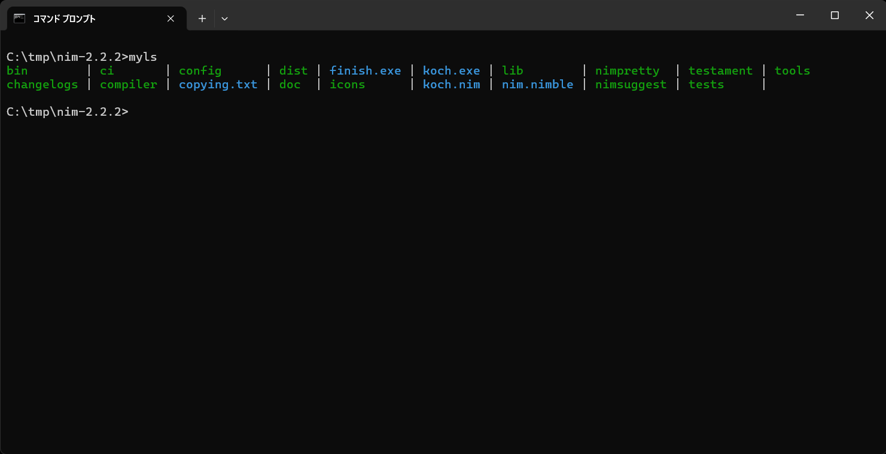

# MYLS
A toy CLI for listing files and directories in a directory like `ls` command in Linux

<div align="center">

</div>

## How to use
```bash
myls [DIRECTORY]
```

## How to build
Install [nim](https://nim-lang.org/install.html) compiler, then

```bash
git clone myls.git
cd myls
nim c -d:release myls.nim
```

## How to change output colors
By default, files are colored cyan and directories green.
If you want to change those colors, build it like this.

```bash
nim c -d:release -d:file_color=red -d:dir_color=yellow myls.nim
```

Then outputs will be like this.

<div align="center">

</div>

The supported colors are
- black
- white
- red
- green
- blue
- yellow
- cyan
